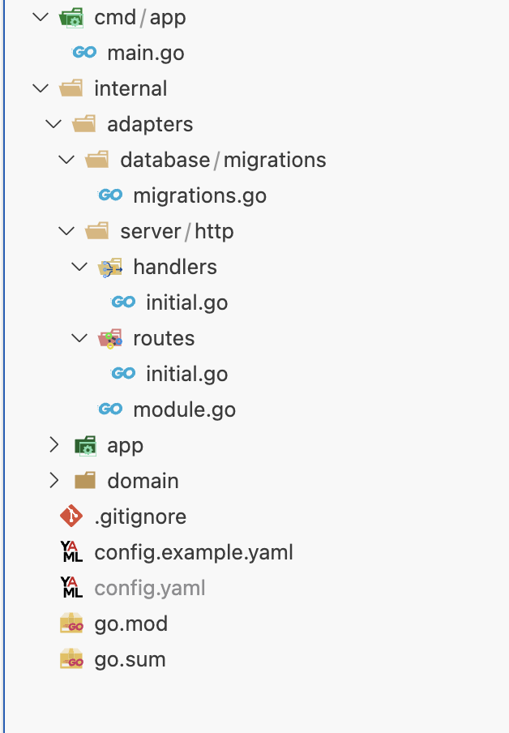

# Create a new app

To create your first app, you can use the following command: 

```bash
liquor app create --name <app-name> --pkg <app-package>
```

When you create a new app, you get a fully prepared boilerplate for a web application, including a server, logger, and configuration file ready to use.

Copy the config.example.yaml file to config.yaml to set up the initial configuration for your application.

> Important: The config.yaml file should not be included in your repository, as it contains sensitive information about your application.

```bash
cp config.example.yaml config.yaml
```

Run your application using the initial configurations.

```bash
go run cmd/app/main.go
```

## Structure



In the initial project structure, you will have the following files and directories:

-	`cmd/app/main.go`: This is the startup file for your application, where services and modules are registered.
-	`internal/adapters/database/migrations/migrations.go`: The migrations folder contains all the migrations for your application. The migrations.go file is where you register them to be executed along with your application.
-	`internal/adapters/server/http/handlers`: This directory contains functions responsible for handling requests and passing them to the services.
-	`internal/adapters/server/http/routes`: Here, you define all the route groups for your application.
-	`internal/adapters/server/http/module.go`: In this module, you register your handlers and routes to make them available in your application.
-	`internal/app/services`: This directory contains your business logic.
-	`internal/app/ports`: This is where your interfaces are defined (e.g., repository interfaces).
-	`config.yaml`: This is the configuration file for your application.