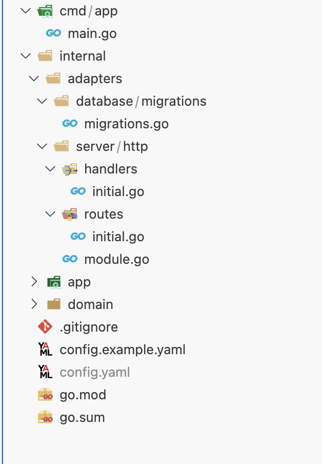

# Structure

In the initial project structure, you will have the following files and directories:

-	`cmd/app/main.go`: This is the startup file for your application, where services and modules are registered.
-	`internal/adapters/database/migrations/migrations.go`: The migrations folder contains all the migrations for your application. The migrations.go file is where you register them to be executed along with your application.
-	`internal/adapters/server/http/handlers`: This directory contains functions responsible for handling requests and passing them to the services.
-	`internal/adapters/server/http/routes`: Here, you define all the route groups for your application.
-	`internal/adapters/server/http/module.go`: In this module, you register your handlers and routes to make them available in your application.
-	`internal/app/services`: This directory contains your business logic.
-	`internal/app/ports`: This is where your interfaces are defined (e.g., repository interfaces).
-	`config.yaml`: This is the configuration file for your application.